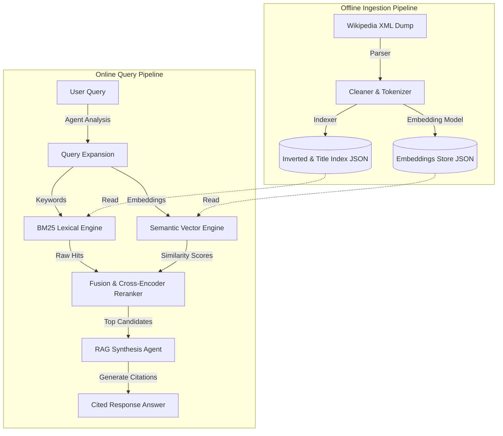

# 🚀 HybridSearchEngine: AI-Powered Hybrid Search & Agentic RAG

HybridSearchEngine is a production-inspired, Python-native hybrid search engine and Retrieval-Augmented Generation (RAG) system. Designed to eliminate context loss in traditional retrieval pipelines, it bridges the gap between classical Information Retrieval (IR) and Generative AI. 

By fusing exact-match keyword search (BM25) with deep contextual vector space representations (Sentence-Transformers), HybridSearchEngine yields superior retrieval precision. The engine employs stateful agentic orchestration via **LangGraph**, utilizing asynchronous LLM-agents to handle query intent classification, query expansion, and synthesize retrieved context into coherent, fully cited answers.

---

## ✨ Features

### 🔍 Search Core
* **Lexical Retrieval (BM25)**: Fast in-memory index built from scratch utilizing document frequency, length normalization ($b=0.75$), and term frequency saturation ($k_1=1.2$).
* **Title-Aware Matching**: Implements a dedicated Title Inverted Index allowing queries to prioritize exact matches on titles.

### 🧠 Semantic Search
* **Local Dense Embeddings**: Generates document embeddings offline utilizing SentenceTransformers (`all-MiniLM-L6-v2`).
* **Cosine Similarity Match**: Fast, vector-based similarity scanning online to capture conceptual intent and synonyms.
* **Hybrid Score Fusion**: Normalizes and fuses lexical and semantic scores using a linear combination:
  $$\text{Final Score} = \alpha \times \text{BM25} + \beta \times \text{Semantic Cosine Sim}$$

### 🔄 Agentic Orchestration
* **Query Expansion**: Deploys LLM-powered Query Analyzers to expand natural language queries with terms that maximize recall.
* **Stateful Agent Workflow (LangGraph)**: Models the RAG system as a multi-actor state graph routing query analyses, parallel retrievals, reranking, and synthesis steps.
* **Response Synthesis (RAG)**: Generates detailed, cited responses grounded strictly in retrieved chunks using OpenAI GPT-4 / Google Gemini.

---

## 🏗️ System Architecture



---

## 📂 Project Structure

```bash
├── data/
│   ├── raw/                 # Raw datasets (e.g., simplewiki.xml)
│   └── index/               # Output JSON index files, metadata, & embeddings
├── src/
│   ├── parser/              # Data parsing (XML, CSV, metadata extractor)
│   ├── preprocessing/       # Cleaning, tokenization, stop-word removal
│   ├── indexer/             # Inverted index structures & JSON file writer
│   ├── ranking/             # Classical retrieval algorithms (BM25 and TF-IDF)
│   ├── semantic/            # Embeddings, vector store, fusion reranker, query expander
│   ├── query/               # Integrated hybrid search engine coordinator
│   └── utils/               # Settings configuration & logging utils
├── api/                     # FastAPI backend REST API
├── scripts/                 # Index compilation CLI tools
├── tests/                   # PyTest unit test suite
├── requirements.txt         # Project dependencies
└── .gitignore               # Ignored files (data/index, venv, pycache)
```

---

## 🛠️ Quick Start & Installation

### Prerequisites
* Python 3.8+
* Git

### Setup Steps

1. **Create and activate a virtual environment:**
   ```bash
   python -m venv venv
   # On Windows (PowerShell):
   .\venv\Scripts\Activate.ps1
   # On macOS/Linux:
   source venv/bin/activate
   ```

2. **Install dependencies:**
   *Note: If you run into build errors compiling `mwparserfromhell` on Windows, disable the C-extension build by setting the environment variable:*
   * **Windows (PowerShell):**
     ```powershell
     $env:WITH_EXTENSION="0"
     pip install -r requirements.txt
     ```
   * **macOS/Linux:**
     ```bash
     WITH_EXTENSION=0 pip install -r requirements.txt
     ```

---

## 🚀 Running the Search Engine

### Step 1: Ingest & Build the Search Index
Place your raw document dump (e.g. `simplewiki.xml`) inside the raw data folder:
`data/raw/simplewiki.xml`

Then run the offline build script to parse documents, index keywords, and compute semantic embeddings:
```bash
python -m scripts.build_index
```

### Step 2: Search via CLI
To query the agentic search engine directly from the command line:
```bash
python main.py --mode agentic_search --query "What is the impact of attention mechanisms in Transformers?"
```

### Step 3: Run the FastAPI Server
To launch the backend API:
```bash
python -m uvicorn api.app:app --reload
```
Open your browser and navigate to `http://localhost:8000/docs` to access interactive Swagger API documentation.

---

## 🧪 Testing

To run the unit test suite:
```bash
python -m pytest
```


